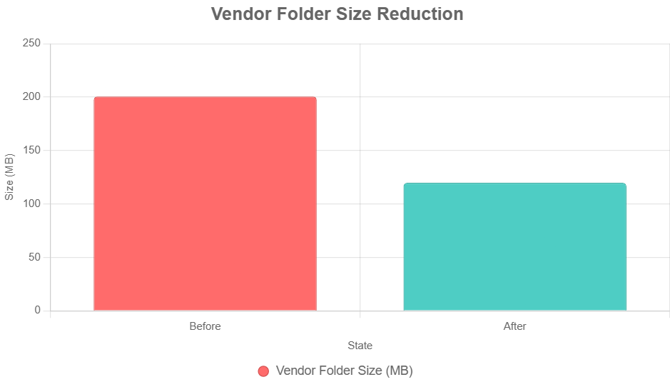

# Optimize Vendor Folder Size

You ever notice how everyone's obsessed with "optimizing" their code or front-end assets, but nobody talks about that sad, bloated **`vendor/` folder** quietly eating up space in your PHP/Laravel project? Yeah, out of sight, out of mind-until your Docker image is the size of a small moon and your CI pipeline moves like it's wearing cement boots.

Honestly, if you care about fast deploys, smaller containers, or just not setting your credit card on fire with storage costs, you *need* to keep that vendor directory under control. When it balloons, everything slows down-deploys, builds, tests. It's just bad news all around.

Got inspired by Joel Clermont's writeup, [How to make the AWS SDK much smaller](https://masteringlaravel.io/daily/2023-10-03-make-aws-sdk-much-smaller). I got curious and decided to see just how much bloat I could chop off in my own Laravel project. Spoiler: 40% reduction, just by cleaning up some low-hanging fruit.

## Step 1: Sniff Out the Biggest Offenders

To understand the problem, I started by inspecting the vendor folder using the following command:

```bash
du -h --max-depth=3 vendor | sort -hr | head -n 20 | column -t
```

Here's what popped out in the local environment:

```
281M  vendor
54M   vendor/aws/aws-sdk-php/src
54M   vendor/aws/aws-sdk-php
54M   vendor/aws
24M   vendor/stevebauman/location/tests
24M   vendor/stevebauman/location
24M   vendor/stevebauman
```

The `aws/aws-sdk-php` package (54MB) and `stevebauman/location` (24MB) stood out. Let's tackle them one by one.

## Step 2: Put the AWS SDK on a Diet

In my project, the AWS SDK showed up because `league/flysystem-aws-s3-v3` wanted it. Except, I only needed S3, not the whole buffet. So, following Joel's lead, I tweaked `composer.json` to only keep the S3 stuff:

```json
{
  "require": {
    "league/flysystem-aws-s3-v3": "^3.0"
  },
  "extra": {
    "aws/aws-sdk-php": [
      "S3"
    ]
  },
  "scripts": {
    "pre-autoload-dump": "Aws\\Script\\Composer\\Composer::removeUnusedServices"
  }
}
```

No need for the full SDK if you're only sipping from one of the fountains, right? This move dropped the AWS folder from 54MB to, like, barely anything. For reference, Joel squeezed his from 37.5MB down to 5.4MB-mine was similar, just swapping out EC2/CloudWatch for S3. If you want the nitty-gritty, AWS has docs [right here](https://github.com/aws/aws-sdk-php/tree/master/src/Script/Composer).

## Step 3: Yank Out Test Fixtures from `stevebauman/location`

So, about that `stevebauman/location` package-it packs in 24MB of test data. For what? You don't need that in production. I dropped a note on their GitHub ([here's the issue](https://github.com/stevebauman/location/issues/399#issuecomment-3146786037)), suggesting they use a `.gitattributes` file to keep the junk out of dist installs:

```text
/tests/ export-ignore
/.github/ export-ignore
/.gitignore export-ignore
/phpunit.xml export-ignore
/README.md export-ignore
```

Credit to Steve, he patched it up quick. After the fix, the package slimmed down nicely. Less dead weight, more speed. Win-win.

## Step 4: Boot Dev Tools Out of Production

Then I realized: why am I shipping dev tools like `laravel/telescope` and `itsgoingd/clockwork` with my production deploys? I only use them on staging. Duh. Yanked 'em over to `require-dev` where they belong:

```json
{
  "require-dev": {
    "laravel/telescope": "^5.0",
    "itsgoingd/clockwork": "^5.0"
  }
}
```

And in CI, made sure prod runs `composer install --prefer-dist --no-dev`. Staging still gets the goodies, prod just gets what it needs. Should've done this, like, three years ago.

## Step 5: Review & Yeet Unused Packages

Finally, I audited the codebase and removed several packages that were barely used or awaiting "better times." You know the ones-stuff you added for "future features" that never materialized. This step required careful consideration, so double-check before you hit delete.

## So... Did It Actually Work?

Oh, it worked. Like, big time. Peep the release sizes after the cleanup:

```
--- /releases ----
200.6 MiB  /20250730073523
200.6 MiB  /20250730132552
126.9 MiB  /20250805144546
122.5 MiB  /20250812072953
119.8 MiB  /20250817131556
```

That's 200.6 MiB down to 119.8 MiB. I mean, come on-look at that drop.



The vendor/ folder went from a chunky 200.6 MB to a svelte 119.8 MB. That's 81 MB, just-poof-gone. Almost 40% lighter. Beyond just the numbers, this brought noticeable wins: faster deployments, smaller Docker images, reduced storage costs, quicker CI/CD runs, less network transfer when caching dependencies, and lighter backups.

## TL;DR for the Lazy

- Run `du` on vendor/ now and then. Find out which packages are hoarding all your disk space.
- Trim SDKs: For AWS, only pull in what you actually use.
- Ask package maintainers to stop shipping tests and docs in production dists.
- Keep dev tools out of production; stick them in require-dev and let CI deal with 'em.
- Prune dead weight: regularly review and drop unused deps, use tool composer-unused [link](https://github.com/composer-unused/composer-unused) for that.

👉 Don't let your PHP vendor/ turn into a node_modules/ 😅

Go run `du -sh vendor/` right now and see what monster is hiding in your project.